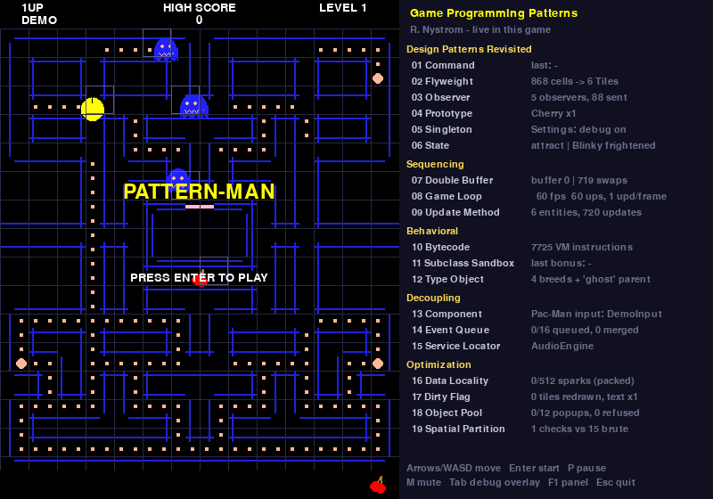

# Pattern-Man: *Game Programming Patterns* in a Pac-Man clone

A playable Pac-Man clone written in Python + pygame to **teach the 19 patterns of Robert
Nystrom's [*Game Programming Patterns*](https://gameprogrammingpatterns.com/contents.html)**.
There is one module per pattern, in the book's order, and each module's comments explain the
pattern from scratch and point to the book's sections. A panel next to the maze shows every
pattern working live.



*Attract mode with the debug overlay (Tab): ghost target tiles, the spatial-partition grid
and the live "patterns at work" panel.*

It reuses the small engine in [`../core`](../core) (window, keyboard, audio init, fonts) from the
emulator in the parent folder, **without changing it**: the Game Loop pattern is implemented by
subclassing `core.game.Game` (see [`patterns/p08_game_loop.py`](patterns/p08_game_loop.py)).

---

## Running it

```sh
cd patterns-pacman
pip install -r ../requirements.txt      # just pygame (tested: pygame 2.6.1, Python 3.9 / 3.12)
python main.py
```

No image, sound or font files are needed: shapes are drawn with `pygame.draw`, sounds are
synthesised square waves ([`support/synth.py`](support/synth.py)), text uses pygame's built-in font.

| Option | Effect |
|---|---|
| `--scale 2` | bigger window (the off-screen frame buffer is scaled, see Double Buffer) |
| `--fullscreen` | full screen |
| `--level N` | start new games on level N (faster ghosts, shorter fright, other fruit) |
| `--invincible` | ghosts can't catch Pac-Man: handy while studying ghost behaviour |
| `--debug` | start with the debug overlay on |
| `--log-audio` | wrap the audio service in the logging decorator (Service Locator) |
| `--seed N` | fixed random seed (frightened ghosts' wandering) |

### Controls

| Key | Action | Pattern behind it |
|---|---|---|
| Arrows / WASD | steer Pac-Man | Command (`MoveCommand`) |
| Enter / Space | start a game | Command → State (`AttractState` → `ReadyState`) |
| P | pause / resume | Command → pushdown automaton (`PausedState` pushed and popped) |
| M | mute / unmute | Command → Service Locator (swaps in `NullAudio`) |
| Tab | debug overlay (ghost targets, collision grid) | Singleton (`Settings`) |
| F1 | show / hide the patterns panel | Singleton (`Settings`) |
| Esc | quit | Command |

The game is classic Pac-Man: 244 dots, four power pellets, four ghosts with their arcade
personalities, scatter/chase waves, the tunnel, bonus fruit, an extra life at 10,000 points
and an attract-mode demo that plays itself. The twist: each fruit has a bonus effect (freeze,
speed boost, scare, extra life), because it makes a nicer Subclass Sandbox example.

---

## The patterns, where they live and what to watch

Each `patterns/pNN_*.py` file starts with a long comment: the book's definition, the problem,
how the pattern solves it, the matching book sections (quoted by their headings), and where
the game uses it. **A module only imports earlier modules**, so you can read them in order
(`tests/test_patterns.py` checks this).

| # | Pattern (book chapter) | Module | Used in the game for | Panel shows |
|---|---|---|---|---|
| | **Design Patterns Revisited** | | | |
| 1 | [Command](https://gameprogrammingpatterns.com/command.html) | [`p01_command.py`](patterns/p01_command.py) | keys → `MoveCommand`/game commands. The demo AI emits the same commands. | last command |
| 2 | [Flyweight](https://gameprogrammingpatterns.com/flyweight.html) | [`p02_flyweight.py`](patterns/p02_flyweight.py) | 868 maze cells share 6 `Tile` objects | cells → Tile objects |
| 3 | [Observer](https://gameprogrammingpatterns.com/observer.html) | [`p03_observer.py`](patterns/p03_observer.py) | score, achievements, ghosts and audio react to gameplay events | observers, notifications |
| 4 | [Prototype](https://gameprogrammingpatterns.com/prototype.html) | [`p04_prototype.py`](patterns/p04_prototype.py) | one `Spawner` clones the level's fruit prototype | prototype, clones |
| 5 | [Singleton](https://gameprogrammingpatterns.com/singleton.html) | [`p05_singleton.py`](patterns/p05_singleton.py) | global debug `Settings`, plus *why we avoid singletons* | debug flag |
| 6 | [State](https://gameprogrammingpatterns.com/state.html) | [`p06_state.py`](patterns/p06_state.py), [`app/game_states.py`](app/game_states.py) | ghost FSM (hierarchical: `Roaming` ⊃ Scatter/Chase), game flow (pushdown: Paused) | state stack, Blinky's state |
| | **Sequencing Patterns** | | | |
| 7 | [Double Buffer](https://gameprogrammingpatterns.com/double-buffer.html) | [`p07_double_buffer.py`](patterns/p07_double_buffer.py) | draw into the hidden buffer, swap, present | which buffer, swaps |
| 8 | [Game Loop](https://gameprogrammingpatterns.com/game-loop.html) | [`p08_game_loop.py`](patterns/p08_game_loop.py) | fixed 60 Hz updates, variable rendering with interpolation | fps, ups, updates/frame |
| 9 | [Update Method](https://gameprogrammingpatterns.com/update-method.html) | [`p09_update_method.py`](patterns/p09_update_method.py) | `World.update` → every entity's `update(dt)` | entities, updates |
| | **Behavioral Patterns** | | | |
| 10 | [Bytecode](https://gameprogrammingpatterns.com/bytecode.html) | [`p10_bytecode.py`](patterns/p10_bytecode.py) | each ghost's chase personality is assembly in `data/breeds.json`, run on a stack VM | VM instructions |
| 11 | [Subclass Sandbox](https://gameprogrammingpatterns.com/subclass-sandbox.html) | [`p11_subclass_sandbox.py`](patterns/p11_subclass_sandbox.py) | fruit `activate()` built only from the base class's operations | last bonus |
| 12 | [Type Object](https://gameprogrammingpatterns.com/type-object.html) | [`p12_type_object.py`](patterns/p12_type_object.py), [`data/breeds.json`](data/breeds.json) | ghost `Breed`s loaded from JSON with copy-down parent inheritance | breeds |
| | **Decoupling Patterns** | | | |
| 13 | [Component](https://gameprogrammingpatterns.com/component.html) | [`p13_component.py`](patterns/p13_component.py) | Pac-Man and ghosts = `GameObject` + input/physics/graphics components | Pac-Man's input component |
| 14 | [Event Queue](https://gameprogrammingpatterns.com/event-queue.html) | [`p14_event_queue.py`](patterns/p14_event_queue.py) | sound requests in a ring buffer, aggregated, played one per update | queued, merged |
| 15 | [Service Locator](https://gameprogrammingpatterns.com/service-locator.html) | [`p15_service_locator.py`](patterns/p15_service_locator.py) | `Locator.get_audio()`, `NullAudio` (mute / no sound card), `LoggedAudio` | current provider |
| | **Optimization Patterns** | | | |
| 16 | [Data Locality](https://gameprogrammingpatterns.com/data-locality.html) | [`p16_data_locality.py`](patterns/p16_data_locality.py) | particles as packed structure-of-arrays, hot/cold split | live particles |
| 17 | [Dirty Flag](https://gameprogrammingpatterns.com/dirty-flag.html) | [`p17_dirty_flag.py`](patterns/p17_dirty_flag.py) | cached maze picture: only eaten tiles are redrawn. Cached score text. | tiles redrawn, text renders |
| 18 | [Object Pool](https://gameprogrammingpatterns.com/object-pool.html) | [`p18_object_pool.py`](patterns/p18_object_pool.py) | floating score popups from a fixed pool with a free list | in use, refused |
| 19 | [Spatial Partition](https://gameprogrammingpatterns.com/spatial-partition.html) | [`p19_spatial_partition.py`](patterns/p19_spatial_partition.py) | grid of linked units for Pac-Man/ghost/fruit collisions | checks vs brute force |

---

## How to study the code

The book is free online, and its source is on
[GitHub](https://github.com/munificent/game-programming-patterns/tree/master/book). Keep the
matching chapter open next to each module.

1. **Play first** (5 minutes). Run `python main.py`, watch the attract demo, then play a
   game. Keep an eye on the panel: eat a dot and watch *Dirty Flag* redraw 1 tile and
   *Event Queue* blip; eat a power pellet and watch *State* switch Blinky to "frightened";
   press P and watch the *State* stack become `playing>paused`; press M and watch the
   *Service Locator* switch to `NullAudio`. Press Tab and see the ghosts' target tiles move.
2. **Read the book's introductory chapters**
   ([Architecture, Performance, and Games](https://gameprogrammingpatterns.com/architecture-performance-and-games.html)).
   They frame the whole book: decoupling versus speed versus simplicity.
3. **Read the modules in order, one sitting per section.** For each `pNN` file:
   1. read the book chapter's *Intent* and *Motivation*;
   2. read the module's header comment (it retells the chapter in terms of this game);
   3. read the code, then find where it's used (`grep -n "pNN" app/*.py`, or the search
      hint in each header's "WHERE IT IS USED IN THE GAME");
   4. read the matching test class in [`tests/test_patterns.py`](tests/test_patterns.py):
      each test is a compact statement of what the pattern promises;
   5. do the experiment for that pattern (below).
4. **Then read [`app/game.py`](app/game.py)** top to bottom. Its docstring shows one fixed
   update as a call tree annotated with pattern numbers. It is where all 19 meet.
   [`app/game_states.py`](app/game_states.py) is a second, larger State example.
5. **Finally, step back**: notice which patterns *decouple* (Command, Observer, Component,
   Event Queue, Service Locator), which *make behaviour data* (Prototype, Type Object,
   Bytecode), and which *only exist for speed* (Flyweight, Data Locality, Dirty Flag, Object
   Pool, Spatial Partition). The book's advice is to use the speed patterns only when you
   need them. With six actors, Spatial Partition is here purely to teach (the panel shows how
   little it saves), and the module says so.

### Experiments, one per pattern

| # | Try this |
|---|---|
| 1 | Add a `bind_move` call in `InputHandler.__init__` to steer with I/J/K/L. Then give Pac-Man the `DemoInputComponent` while you play (`self.pacman.input = self.demo_input` in `new_game`). |
| 2 | Add a seventh flyweight, e.g. a "slow floor" `Tile` (char `~`) that halves Pac-Man's speed, and put a few in `support/maze_layout.py`. |
| 3 | Write a `DeathCounter(Observer)` that prints how many times Pac-Man died, and subscribe it in `PatternManGame.init`. No other code changes. |
| 4 | Make the Spawner hold a prototype with a modified `lifetime` (e.g. 20 s) and see every clone inherit it. |
| 5 | Turn `Settings` into plain module variables (the Python way) and see how little changes. Then read "What We Can Do Instead" again. |
| 6 | Add a `Cornered` ghost state, or make the Dying state *push* over Playing instead of replacing it. |
| 7 | In `render`, draw straight into `self.get_graphics().get_backbuffer()` instead and think about why `--scale 2` stops working. |
| 8 | Replace `FixedTimestepGame.run` with the book's "Take a little nap" loop (as in `core/game.py`) and add `pygame.time.delay(30)` in `render`: the game slows down. With "Play catch up" it doesn't. |
| 9 | Add an entity that spawns a new entity from inside its `update`. Check it doesn't update until the next frame. |
| 10 | Invent a fifth ghost in `data/breeds.json` with a new `chase_program`, e.g. target the mirror image of Pac-Man (`LIT 27 PAC_X SUB  LIT 30 PAC_Y SUB SET_TARGET`). No Python needed. |
| 11 | Write a new fruit subclass using only the sandbox operations, and put it in `FRUIT_BY_LEVEL`. |
| 12 | Give Clyde `"speed": 0.95` in `breeds.json`. Make a "pinky_fast" breed whose parent is "pinky". |
| 13 | Write a `TrailGraphics` component that wraps `PacmanGraphics` and emits sparks behind Pac-Man while the speed boost is on, without touching the input or physics components. |
| 14 | Make `AudioEngine.update` drain the whole queue each call, and compare the panel. Remove the aggregation loop and eat dots quickly: the chomp gets louder. |
| 15 | Run with `--log-audio`. Then write a `CountingAudio` decorator. |
| 16 | Rewrite `ParticleSystem` as a list of `Particle` objects with an `alive` flag, then compare code and timings (`python -m timeit` or `cProfile`). |
| 17 | Remove `maze.changed.clear()` (or the `add` in `Maze.eat`) and watch the bug the book warns about: stale pixels. |
| 18 | Shrink `PopupPool.POOL_SIZE` to 2 and eat four ghosts in one power pellet: the panel's "refused" goes up. |
| 19 | Add 200 invisible units to the grid in `_collide` and compare "checks" with "brute force". |

---

## Folder layout

```
patterns-pacman/
  main.py                 entry point (puts ../core on sys.path)
  patterns/               the 19 pattern modules, p01 ... p19, in book order
  app/                    the game assembled from the patterns
    game.py               PatternManGame: rules + wiring (every pattern is used here)
    game_states.py        game flow on a pushdown automaton
    panel.py              the live "patterns at work" panel
  support/                plain helpers: constants, maze text, synth, drawing, text
  data/breeds.json        ghost breeds (Type Object) with bytecode personalities
  tests/                  unit tests per pattern + headless whole-game tests
  docs/screenshot.png
```

## Tests

```sh
cd patterns-pacman
python -m unittest discover -s tests -t .        # or: python -m pytest tests
```

The tests run headless (SDL's dummy video and audio drivers). `test_patterns.py` has one test class
per pattern and checks that each module only imports earlier ones. `test_game.py` drives the
whole game with fake time and keys: attract mode, start, pause, eating a ghost, losing a
life, clearing a level, fruit and mute.

## Simplifications compared with the arcade

To keep the code readable:
- Ghosts leave the house on timers (from `breeds.json`), not dot counters.
- The ghosts have no "no turning up" zones, and there is no Pinky/Inky "up" overflow bug.
- Levels speed up smoothly rather than following the arcade's exact tables.
- Pac-Man has no cornering advantage and doesn't pause on each dot.
- The fruits' extra effects are an invention of this version.

## Credits

- Patterns, structure and quoted section names: Robert Nystrom,
  [*Game Programming Patterns*](https://gameprogrammingpatterns.com/) (2014), free to read online.
- Engine: the shared [`core`](../core) package of this repository.
- Pac-Man is © Bandai Namco. This is a non-commercial, educational re-implementation and uses
  no original assets.
